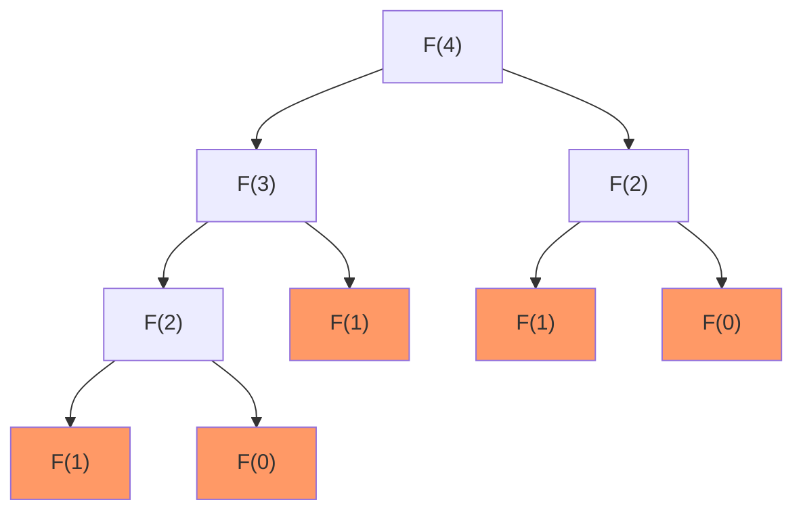

# Discussion Coding Battle du Shaker 2020

## Récursion

Consiste à résoudre un problème informellement de la manière suivante :

* Si l'instance courante peut être directement résolue, alors il faut directement la résoudre.
* Sinon, la réduire à une instance plus petite du même problème.

On doit avoir un nombre fini d'appels récursifs lors de la résolution d'instance plus petite. Comme un appel récursif conduit à la résolution d'une instance plus petite, on arrivera nécessairement à une instance _élémentaire_ appelée **cas de base** (il s'agit de la plus petite instance possible du problème) qui doit pouvoir être résolue d'une différente manière.

---

## Fibonacci

La fonction $F$ suivante calcule le $n$-ème nombre de Fibonacci :

$$
    \begin{align}
    F(0) & = 0\\
    F(1) & = 1\\
    F(n) & = F(n-1) + F(n-2) \mbox{ } \forall n \geq 2.
    \end{align}
$$

La résolution de l'instance de taille $n$ nécessite la résolution des instances de taille $(n-1)$ et $(n-2)$. En pseudo-code, nous avons l'algorithme suivant :

```md
F(n) :
    if n <= 1 then :
        return n
    else :
        return F(n-1) + F(n-2)
```

### Arbre de récursion

Voici l'arbre des appels récursifs à la fonction $F$ pour le calcul de $F(4)$.




---
